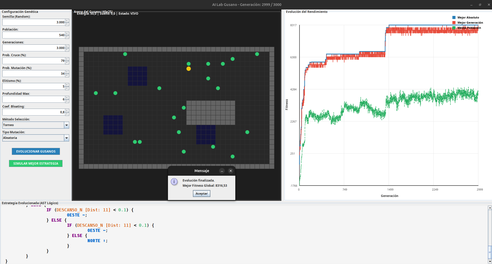

# Worm Evolution: Advanced Genetic Programming Simulation

This project is a behavioral simulation of worms evolved through **Advanced Genetic Programming (GP)**. The goal is to observe emergent survival strategies in a competitive environment using logic-based evolutionary computation and context-free grammars.

## Project Concept & Reflection

Initially, this project was conceived as an attempt to simulate biological life and decision-making without the overhead of advanced neural network libraries (such as those simulating 300+ neurons). I wanted to explore how far a grammar-based logic system could go in replicating the complexity of life.

### The "Robotic" Threshold
During development, I observed that while the Genetic Algorithm successfully finds winning strategies (eating, avoiding obstacles, and managing energy), the resulting behaviors feel **distinctly robotic**. Because the "brains" are Abstract Syntax Trees (AST) based on strict logical grammars, the worms follow deterministic paths that are efficient but lack the fluid, stochastic nature of biological organisms.

### Future Work
Recognizing this limitation, the next phase of this research will transition into **true brain simulation**. I plan to utilize specialized libraries that simulate neural connectivity and synaptic weights more closely to biological structures, moving away from pure logic trees to achieve more natural behaviors.

---

## Technical Features

* **Advanced Genetic Algorithm:** Implementation of selection, crossover, and mutation tailored for tree structures.
* **Grammar-Based Individuals:** Uses a Context-Free Grammar (CFG) to define valid behaviors, sensors, and conditional logic.
* **Anti-Bloating Mechanisms:** Includes Parsimony Pressure (Bloating Coefficient) and Maximum Depth control to maintain efficient and readable code trees.
* **Diverse Mutation Arsenal:** * **Subtree Mutation:** Generates new logical branches.
    * **Hoist (Pruning):** Reduces complexity by promoting subtrees to roots.
    * **Functional Mutation:** Modifies internal sensors and operators.
    * **Terminal Mutation:** Adjusts final actions (North, South, East, West).
* **Real-time Visualization:** A custom graphical interface to monitor population fitness, energy, and logic structures.

---

## Interface

Below is a screenshot of the simulation environment where the worms compete and evolve their survival logic:


---

## How it Works

The "brain" of each worm is an evolved **Abstract Syntax Tree (AST)**. The algorithm evaluates thousands of these combinations, selecting the ones that survive longest and consume more resources, effectively "programming" the worms through artificial evolution.


Example of an evolved logic snippet:
```javascript
IF (OBSTACLE_FRONT [Dist: 3] > 0.8) {
    IF (ENERGY < 20.0) {
        MOVE_WEST;
    } ELSE {
        ROTATE_LEFT;
    }
} ELSE {
    MOVE_FORWARD;
}
